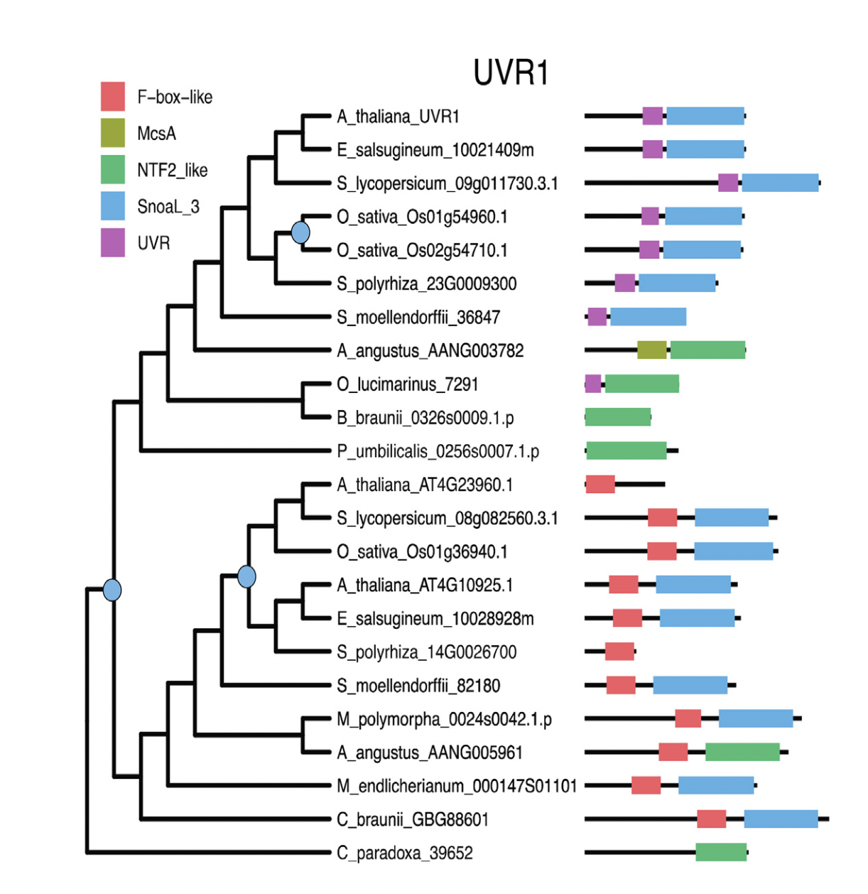

# Understanding protein evolution by connecting phylogenetic trees to domain architecture

## Overview
Our workflow consists of the following steps:
1. *Download this github repository and save onto your computer*
1. *Locate input files and the provided R-script*
1. *Open the R-script in R-studio and follow the directions to perform the following steps*
	* *Multiple sequence alignment*
	* *Phylogenetic tree inference*
	* *Domain prediction (web-based, outside of R)*
	* *Generate a ggtree plot that combines the tree and the domain data*
